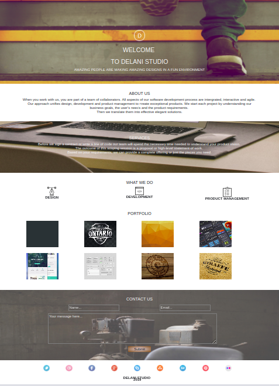

# DELANI STUDIO

#### Check out Delani studio [here](https://github.com/tonnyblair62/Delani-Studios.git)

Last modified 25th July 2021.
#### By **Tonny Blair**
## Description
Delani studio is a recreated landing page of a fictional studio. The aim is to use jQuery to increase interactivity of the page.
## Project Behaviour
* The 'What we do'  icons when clicked should toggle between the respective description of each icon. The description should be centered aligned.
 The header should be in bold and centered also. This should be achieved by using jQuery.
* There should be a Hover effect for the **Portfolio** sections such that on hover a white box appears with then name of the project inside.
 The project picture should still be visible in the background. This should be achieved using jQuery.
* The site should be responsive.
* The user should know through a pop up that their message has been received and also thank them for contacting Delani Studio.
 For example: "*Hi phabian, we have received your message. Thank you for reaching out to us.*"

 
## Setup/Installation Requirements
* Git clone https://github.com/tonnyblair62/Delani-Studios.git
* cd Delani-studio
* open index.html file on your preferred browser
## Technologies Used
HTML, CSS and JQUERY
## Support and contact details
To contribute, submit a pull request. 
For questions or concerns, reach out on tonnyblairma@gmail.com
### License
*MIT*

### &copy; 2021 Tonny Blair